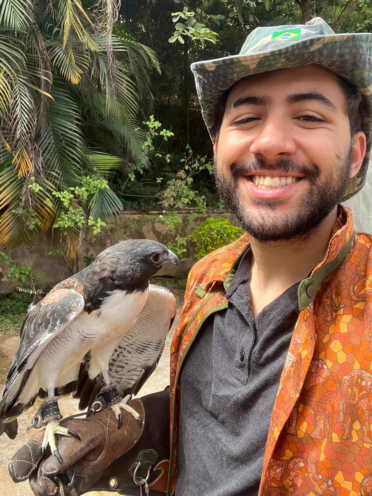

You've seen my work - here is the real me!

I love animals! (Who doesn’t?) Just before the pandemic hit, I joined a falconry group here in Belo Horizonte and was responsible for rehabilitating an owl (_Glaucidium brasilianum_) and a hawk (_Rupornis magnirostris_). In the image below, you can see me taking part in a voluntary educational activity (ecology awareness) with an eagle (_Geranoaetus albicaudatus_) personally owned by my mentor, DVM Mateus Maia, in 2021.

While I don't own any birds of prey, I do have a pet puppy! Her name is Kuma - she's a Chow Chow and just turned two.

I'm big on sports. I've recently started running and weightlifting, with a clear goal of completing a half marathon in 2026. Snowboarding, though, is my real obsession - that's where I hit peak happiness. I try to ride every year. Below is me on a sunny day at the summit of Mt. Werner (10,568 ft / 3,224 m) in Steamboat Springs, Colorado, USA.

Last but not least, I love reading — both fiction and non-fiction. I’m currently finishing *Rhythm of War* (The Stormlight Archive, Brandon Sanderson) and *Thinking, Fast and Slow* (Daniel Kahneman). I’m also big on music and board games, with *Wingspan* being my current go-to game.
